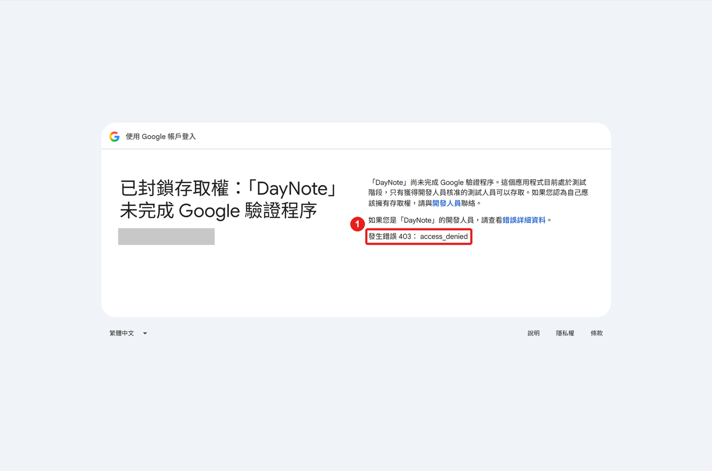

# DayNote

Windows 桌面便利貼：月曆＋待辦，與 Google Tasks／Google 日曆同步。只用 Python 標準函式庫。

<p align="center"></p>

## 功能

- 月曆圓點：🔵 待辦　🔴 逾期　⚪ 只有行程
- 週末與國定假日紅字；右上角三角：🔺紅＝放假節日、🔸橘＝一般節日（點日期看名稱）
- 點任務開啟詳細頁：改標題、詳細資訊、日期，新增子工作，刪除
- 點圓圈完成（含子工作），5 秒內可「復原」
- 提醒時間：新增時按「⏰」或在詳細頁設定，時間到在右下角跳出提醒（可「10 分鐘後」再提醒）
- 新增時用「📅 今天 ▾」選日期，或「無日期」；清單選單最後一項「＋ 新增清單…」可建立新清單
- 背景執行：不佔工作列，`—` 隱藏、**Ctrl + Alt + D** 叫回；Win + D 後仍留在桌面；可置頂、收合月曆

## 資料夾結構

```
DayNote\
├─ StartDayNote.bat      點兩下啟動 DayNote
├─ SetupAutostart.bat    點兩下設定開機自動啟動
├─ README.md
├─ app\                  程式（daynote.pyw）
├─ data\                 個人資料：config.json、token.bin、state.json（不上傳、不打包）
├─ tools\                開發用：build_portable.py（打包可攜版）
├─ docs\images\          README 截圖
├─ runtime\              可攜版才有：內附的 Python
└─ dist\                 打包輸出（不上傳）
```

## 安裝設定

需要 Windows 10/11 與 Google 帳號。API 個人使用免費，不需綁卡。

| 版本 | 適合 | 需要安裝 |
|---|---|---|
| **可攜版**（[`DayNote-portable.zip`](https://github.com/MinHao1103/DayNote/releases/latest/download/DayNote-portable.zip)） | 一般使用、換電腦 | 不需要，內附 Python，解壓縮即可 |
| 原始碼版（本 repo） | 開發 | [Python 3.10+](https://www.python.org/downloads/)（保留預設勾選的 tcl/tk） |

### 下載（不需要 git）

**可攜版（建議）**：下載 [DayNote-portable.zip](https://github.com/MinHao1103/DayNote/releases/latest/download/DayNote-portable.zip) → 右鍵「解壓縮全部」→ 點兩下 `DayNote\StartDayNote.bat`，接著做「第一次設定」。不用裝 Python。

**原始碼版**：

1. 點這個連結下載：<https://github.com/MinHao1103/DayNote/archive/refs/heads/main.zip>
   （或在本頁上方按綠色 **Code** → **Download ZIP**）
2. 在「下載」資料夾對 `DayNote-main.zip` 按右鍵 →「解壓縮全部」→ 選要放的位置，例如 `D:\`
3. 解壓後的 `DayNote-main` 資料夾就是 DayNote，可以改名成 `DayNote`
4. 安裝 [Python 3.10+](https://www.python.org/downloads/)：保留預設選項，按「Install Now」即可
5. 點兩下 `StartDayNote.bat`，接著做下面的「第一次設定」

> 點兩下 `.bat` 若跳出「Windows 已保護您的電腦」：按「其他資訊」→「仍要執行」。

### 自己打包可攜版

可攜版由原始碼版產生：`python tools\build_portable.py` → `dist/DayNote-portable.zip`（約 16 MB，不含任何個人檔案）。

換電腦時：解壓縮可攜版（或複製整個資料夾，含 `data\config.json`），重新登入一次即可；`data\token.bin` 綁定原本的 Windows 帳號，無法沿用。

## 第一次設定

約 10 分鐘，只需做一次。需要一個 Gmail 帳號。圖中紅框 **①②③** 是要點的地方。

### 1. 開啟 DayNote

點兩下 `StartDayNote.bat`，會跳出「首次設定」視窗。先放著，照下面步驟取得金鑰檔。


### 2. 建立 Google Cloud 專案

1. 打開 <https://console.cloud.google.com/>，用 Gmail 登入（第一次會要你同意條款：勾選 → 同意並繼續）
2. 網址列貼上 <https://console.cloud.google.com/projectcreate>
3. ① 專案名稱輸入 `DayNote` → ② 按「建立」


4. 右上角跳出通知，按 ①「選取專案」


5. 確認左上角 ① 顯示 `DayNote`


### 3. 開啟 Google Tasks API

1. ① 最上方搜尋框輸入 `Google Tasks API` → 點 ② 第一個結果（**不是** Cloud Tasks）


2. 按 ①「啟用」


3. 看到 ①「已啟用」就完成


### 4. 開啟 Google Calendar API

搜尋框輸入 `Google Calendar API` → 點第一個結果 → 按 ①「啟用」


### 5. 設定同意畫面

1. 網址列貼上 <https://console.cloud.google.com/auth/overview> → 按 ①「開始」


2. 應用程式資訊：① 名稱輸入 `DayNote` → ② 電子郵件選你的 Gmail → ③「下一步」


3. 目標對象：① 選「外部」→ ②「下一步」


4. 聯絡資訊：① 輸入你的 Gmail → ②「下一步」


5. 完成：① 勾選「我同意」→ ②「繼續」


6. 按 ①「建立」


### 6. 加入自己為測試使用者

1. 點左側 ①「目標對象」


2. 往下捲，按 ①「Add users」→ ② 輸入你的 Gmail，按 Enter → ③「儲存」


3. 確認 ① 清單出現你的 Gmail


### 7. 建立並下載金鑰檔

1. 點左側 ①「用戶端」→ ②「建立用戶端」


2. 應用程式類型選 ①「**電腦版應用程式**」（最後一個）


3. ② 名稱輸入 `DayNote` → ③ **不要勾** → ④「建立」


4. 按 ①「**下載 JSON**」，檔案會存到「下載」資料夾（檔名 `client_secret_` 開頭）→ 按「確定」


> ⚠️ 關掉這個視窗就不能再下載。沒下載到：回「用戶端」刪除 DayNote，重做第 7 步。

### 8. 選擇金鑰檔

回到 DayNote 的「首次設定」視窗 → 按 ②「選擇金鑰檔…」→ 選「下載」資料夾裡 `client_secret_` 開頭的檔案 → 按「開啟」


### 9. 登入

1. 按右上角 ①「登入」，瀏覽器會打開 → 選你的 Gmail

<p></p>

2. 出現「未經 Google 驗證」→ 按 ①「繼續」


3. ① 勾選「全選」→ ③「繼續」


4. 看到 ① 這行字，關掉分頁。**完成！**


## 使用

點兩下 `StartDayNote.bat` 啟動，背景執行、無命令列視窗。重複執行時舊的會自動關閉，只留一個。

DayNote 不會出現在工作列與 Alt + Tab。按 `—` 隱藏到背景（提醒照常跳出），按 **Ctrl + Alt + D** 叫回；按 Win + D 時 DayNote 仍留在桌面。想要工作列圖示，在 `data\config.json` 設 `"show_in_taskbar": true`。

| 快捷鍵 | 功能 |
|---|---|
| `Ctrl+Alt+D` | 顯示／隱藏 DayNote（任何時候都能用） |
| `Ctrl+N` | 新增工作 |
| `←` `→` / `↑` `↓` | 前後一天 / 一週 |
| `Home` | 今天 |
| `F5` | 同步 |
| `Esc` | 離開輸入框／詳細頁 |

**開機自動啟動**：點兩下 `SetupAutostart.bat`，選「1 開啟」或「2 關閉」（也可在命令列執行 `SetupAutostart.bat on`／`off`／`status`）。開機後在背景執行，不會出現命令列視窗。

**登出／換帳號**：按右上角「登出」→「是」。會撤銷 DayNote 的 Google 存取權並刪除本機登入資料，之後按「登入」即可重新驗證或換帳號。

**避免每 7 天重新登入**：「目標對象」→「發布應用程式」。個人使用免審核。

## 設定

| 欄位 | 預設 | 說明 |
|---|---|---|
| `client_id` / `client_secret` | 必填 | OAuth 用戶端 |
| `ca_file` | `""` | 公司網路出現「TLS 憑證驗證失敗」時，填根憑證（PEM）路徑 |
| `borderless` | `true` | `false` 改回一般視窗 |
| `pin_to_desktop` | `true` | Win + D 後仍顯示 |
| `show_in_taskbar` | `false` | `false`＝背景執行，不顯示工作列圖示；`true`＝顯示工作列圖示，點圖示可縮小 |
| `holiday_calendar` | 台灣假日 | Google 公開假日日曆 ID；`""` 關閉 |
| `desktop_reminder` | `true` | 電腦端右下角提醒；`false` 關閉 |

## 不能執行 .bat 時（手動啟動）

點兩下 `.bat` 沒反應、被公司電腦擋下，或一閃就關掉時，改用指令啟動：

1. 打開 DayNote 資料夾（有 `StartDayNote.bat` 的那層）
2. 點檔案總管上方的**網址列**，輸入 `powershell` 按 Enter，會開啟一個已經在這個資料夾的視窗
3. 依版本貼上一行指令，按 Enter：

| 版本 | 指令 |
|---|---|
| 可攜版（有 `runtime` 資料夾） | `.\runtime\pythonw.exe app\daynote.pyw` |
| 原始碼版（有安裝 Python） | `pyw -3 app\daynote.pyw` |
| 上一行顯示「找不到 pyw」 | `pythonw app\daynote.pyw` |

執行後 PowerShell 視窗可以關掉，DayNote 會繼續執行。

**啟動後沒畫面、想看錯誤訊息**：把指令裡的 `pythonw` 換成 `python`（`pyw` 換成 `py`），錯誤會顯示在 PowerShell 視窗：

```powershell
.\runtime\python.exe app\daynote.pyw   # 可攜版
py -3 app\daynote.pyw                  # 原始碼版
```

**下載的檔案被 Windows 封鎖**（右鍵「內容」最下方有「解除封鎖」）：在同一個 PowerShell 視窗執行下面這行，解除整個資料夾的封鎖：

```powershell
Get-ChildItem -Recurse | Unblock-File
```

**不用 .bat 設定開機自動啟動**：按 `Win + R`，輸入 `shell:startup` 按 Enter → 在開啟的資料夾按右鍵「新增」→「捷徑」→ 位置貼上（路徑換成你的 DayNote 資料夾）：

```
"D:\DayNote\runtime\pythonw.exe" "D:\DayNote\app\daynote.pyw"
```

原始碼版只貼後半段：`"D:\DayNote\app\daynote.pyw"`。

## 常見問題



| 狀況 | 處理 |
|---|---|
| 403 `access_denied` | 帳號沒加進測試使用者，或剛加入需等幾分鐘 |
| 「設定檔有誤」 | `data\config.json` 格式錯誤（例如少逗號）；刪除後重新執行會跳出首次設定 |
| `invalid_client` | 用戶端剛建立未生效，或 ID／密鑰有誤 |
| DayNote 顯示 HTTP 403 | 登入時權限沒全勾：刪除 `data\token.bin` 重新登入 |
| 「登入已過期」 | 測試中的專案 7 天到期，重新登入 |
| 視窗異常 | `data\config.json` 設 `"borderless": false` |
| 點兩下 `.bat` 沒反應或被擋 | 見[不能執行 .bat 時](#不能執行-bat-時手動啟動) |

## 限制

- Google Tasks API 不支援：星號、時間、粗體等格式、圖片
- 提醒時間存在詳細資訊第一行（`⏰ 15:00`），手機 App 看得到這行字但不會推播；只有 DayNote 開著時才會提醒
- Windows 系統通知出現時，可能暫時蓋住 DayNote 的提醒視窗
- 日曆只讀主日曆，不能編輯
- 節日資料來自 Google 台灣假日日曆，不含補班日
- 子工作一律顯示在父工作下方
- 跨清單搬移工作請用 Google Tasks App
- 刪除無法在 DayNote 復原
- 釘在桌面時，檔案總管重新啟動會連帶關閉 DayNote
