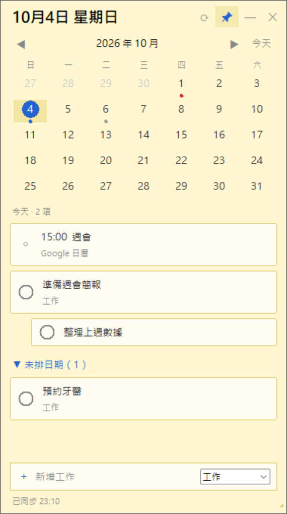
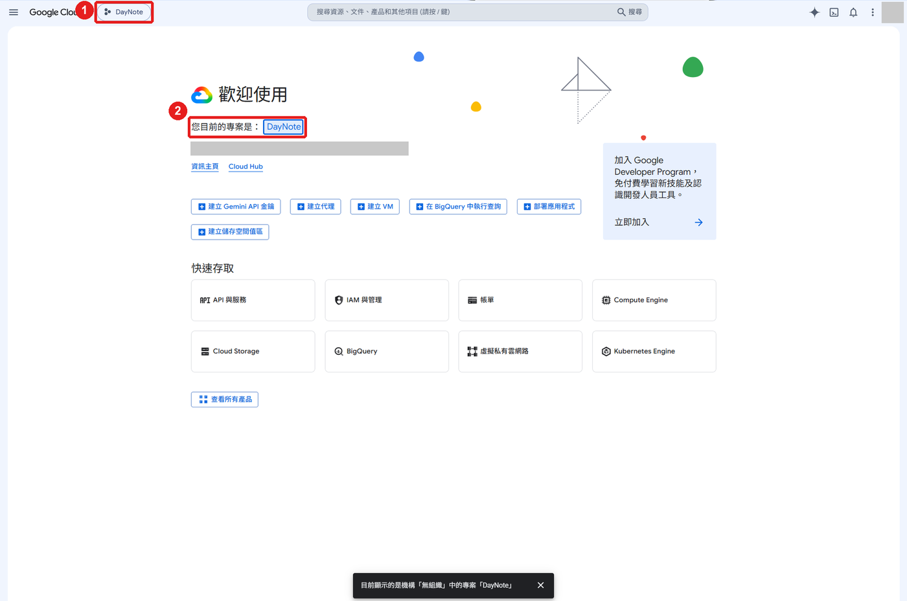
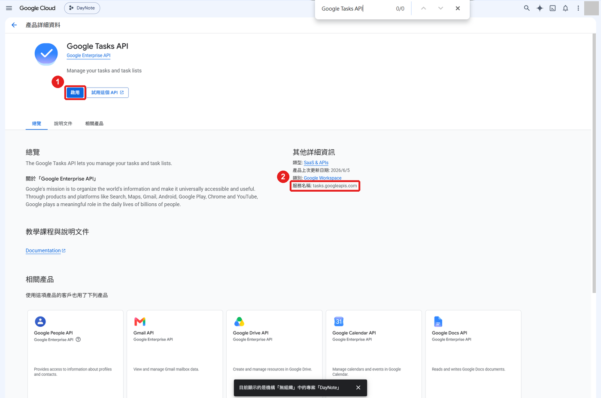
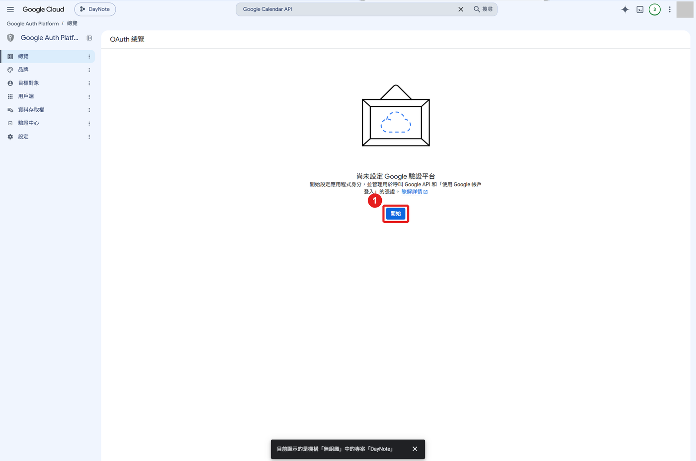
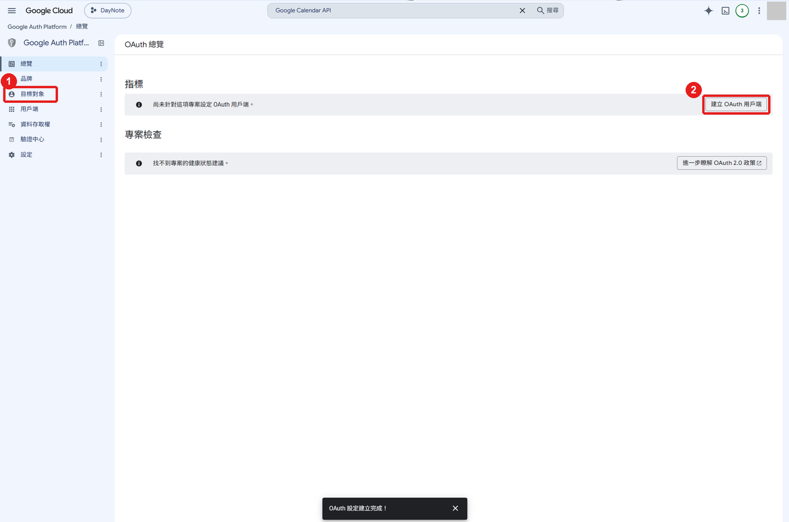
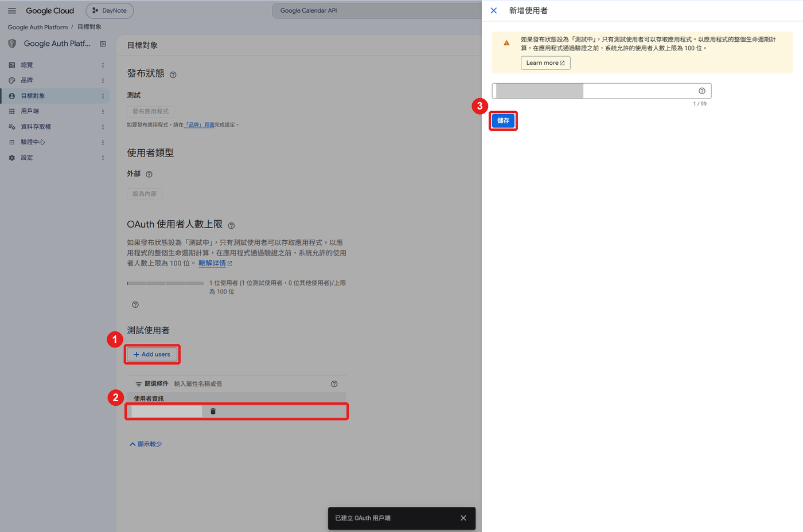
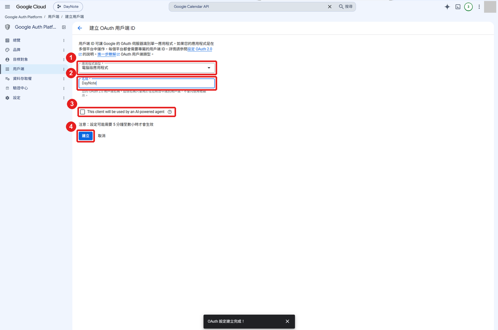
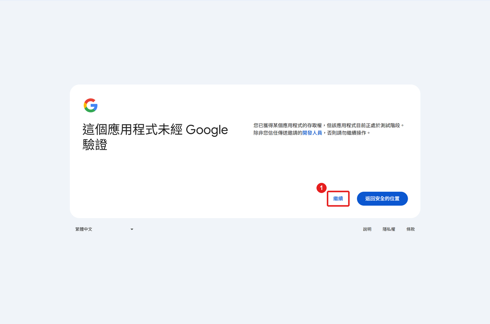
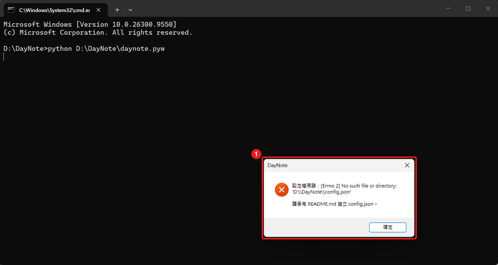

# DayNote

Windows 桌面的「月曆＋待辦」便利貼小工具，和你的 Google 帳號同步：

- **Google Tasks**：存待辦，電腦和手機（Google 工作 App）同步
- **Google 日曆**：唯讀顯示主日曆的行程
- 只用 Python 標準函式庫，不需要 `pip install`，也不用打包成 exe

<p align="center"></p>

## 目錄

1. [功能](#功能)
2. [首次設定（圖文教學）](#首次設定圖文教學)
3. [日常使用](#日常使用)
4. [設定檔說明](#設定檔說明)
5. [常見問題](#常見問題)
6. [檔案說明](#檔案說明)
7. [官方文件查證結果](#官方文件查證結果2026-10-04)
8. [已知限制](#已知限制)

## 功能

- **月曆**：切換月份、回到今天；日期下方的圓點：🔵 有待辦、🔴 有逾期未完成的待辦、⚪ 只有日曆行程
- **點日期**：下方列出當天的日曆行程（唯讀）與待辦，清單上方顯示「今天 · N 項」；逾期待辦以紅字「已逾期」標示
- **子任務**：比照 Google Tasks App，子任務縮排顯示在父任務下方
- **完成任務**：點任務卡片左側的圓圈（滑鼠移上去顯示 ✓），任務即標記完成並消失；完成父任務時，子任務一併完成
- **功能說明**：滑鼠停在按鈕上約 0.5 秒，會顯示這個按鈕的用途
- **新增任務**：底部輸入列打字後按 Enter，新增到「目前選中的日期」，右側下拉選清單
- **未排日期**：沒有到期日的待辦放在可收合的區塊，預設收起
- **同步**：右上角 `⟳` 手動同步；切換到 DayNote 視窗時自動同步（30 秒內不重複）
- **便利貼外觀**：淡黃底色、無系統標題列、Win11 圓角；記住位置、大小與置頂狀態
- **釘在桌面**：按 Win + D 顯示桌面時，DayNote 仍留在桌面上

## 首次設定（圖文教學）

> 第一次使用需要在 Google Cloud Console 建立一個「自己專用」的專案，約 10～15 分鐘，只需做一次。
> 截圖為繁體中文介面；圖中的 **紅框編號** 對應文字步驟。Google 介面可能改版，以實際畫面為準。

**事前準備**

- Windows 10 / 11，已安裝 **Python 3.10 以上**（命令列輸入 `python --version` 確認）
- 一個 Google 帳號（個人 Gmail 即可）
- 下載本 repo 到電腦，例如 `D:\DayNote\`

**費用**：Google Tasks API 與 Google Calendar API 在個人使用量下免費（Tasks 每日 50,000 次、Calendar 每專案每日 1,000,000 次以內不收費），**不需要綁定信用卡**。若 Console 要求設定帳單，請先停下確認。

### 步驟 1：建立 Google Cloud 專案

1. 開啟 <https://console.cloud.google.com/>，用你的 Google 帳號登入。
2. 點 **①** 專案選擇器 → 右上角「**新增專案**」→ 專案名稱填 `DayNote` → 「**建立**」。
3. 建立後再點一次 **①**，**切換到 DayNote 專案**；確認 **②** 顯示「您目前的專案是：DayNote」。



> 建議為 DayNote 單獨建一個專案：權限分開，日後不用時整個專案刪除也不影響其他服務。之後每一步都請確認左上角是 **DayNote**。

### 步驟 2：啟用 Google Tasks API

1. 點右上角 🔍 搜尋（Console 的搜尋，不是瀏覽器的 Ctrl+F），輸入 `Google Tasks API` 並點選結果。
2. 確認 **②** 服務名稱是 `tasks.googleapis.com`，按 **①**「**啟用**」。



> ⚠️ 不要選成「**Cloud Tasks**」，那是另一個需付費的 Google Cloud 服務，和待辦事項無關。

3. 看到 **①** 狀態「**已啟用**」即完成。


### 步驟 3：啟用 Google Calendar API

1. 搜尋 `Google Calendar API`（或在 Tasks API 頁面下方「相關產品」點 Google Calendar API）。
2. 確認 **②** 服務名稱是 `calendar-json.googleapis.com`，按 **①**「**啟用**」。


### 步驟 4：設定 OAuth 同意畫面

1. 左上角 ☰ → 「**API 和服務**」→ 「**OAuth 同意畫面**」，會進入 Google Auth Platform。
2. 按 **①**「**開始**」。



3. 依序填寫精靈的 4 個步驟：

| 精靈步驟 | 填寫內容 |
|---|---|
| ① 應用程式資訊 | 應用程式名稱：`DayNote`；使用者支援電子郵件：選自己的 Gmail → 下一步 |
| ② 目標對象 | 選「**外部**」（個人 Gmail 只能選外部）→ 下一步 |
| ③ 聯絡資訊 | 填自己的 Gmail → 下一步 |
| ④ 完成 | 勾選同意《Google API 服務：使用者資料政策》→ 繼續 → **建立** |

4. 出現「OAuth 設定建立完成！」後，先點左側 **①**「**目標對象**」做下一步（**②** 建立 OAuth 用戶端留到步驟 6）。



### 步驟 5：加入測試使用者

1. 在「目標對象」頁往下到「**測試使用者**」，按 **①**「**Add users**」。
2. 右側面板輸入**要登入 DayNote 的 Gmail**，按 **③**「**儲存**」。
3. 確認 **②** 清單中出現該 Gmail。



> ⚠️ 沒做這一步，登入時會出現「已封鎖存取權」（錯誤 403：access_denied），見[常見問題](#常見問題)。剛加入後可能要等幾分鐘才生效。

### 步驟 6：建立 OAuth 用戶端

1. 左側「**用戶端**」→「**建立用戶端**」（或步驟 4 圖中的「建立 OAuth 用戶端」）。
2. 依圖填寫：

| 編號 | 欄位 | 設定 |
|---|---|---|
| **①** | 應用程式類型 | **電腦版應用程式** |
| **②** | 名稱 | `DayNote` |
| **③** | This client will be used by an AI-powered agent | **不要勾** |
| **④** | — | 按「**建立**」 |



> ⚠️ **用戶端密鑰只在建立當下顯示一次！** 跳出的視窗請立刻按「**下載 JSON**」或複製「**用戶端 ID**」和「**用戶端密鑰**」，關閉後就看不到完整密鑰。萬一沒存到，刪除該用戶端重建即可。設定生效可能需要 5 分鐘至數小時。

### 步驟 7：建立 config.json

在 DayNote 資料夾，把 `config.example.json` **複製一份並改名為 `config.json`**，填入步驟 6 的兩個值：

```json
{
  "client_id": "<CLIENT_ID>.apps.googleusercontent.com",
  "client_secret": "<CLIENT_SECRET>",
  "ca_file": "",
  "borderless": true,
  "pin_to_desktop": true
}
```

> ⚠️ 常見錯誤：把值填進 `config.example.json` 卻沒建立 `config.json`，程式會跳出「設定檔有誤：No such file or directory」。程式只讀 `config.json`。
>
> 🔒 `config.json` 含有密鑰，已列在 `.gitignore`，**不要上傳或分享**。桌面應用的密鑰依 Google 官方說明並非真正機密，但仍不應外流。

### 步驟 8：執行 DayNote 並登入

1. 執行（第一次建議用 `python`，有錯誤時看得到訊息）：

   ```bat
   python D:\DayNote\daynote.pyw
   ```

2. 按右上角 **①**「**登入**」，瀏覽器會開啟 Google 登入頁；**②** 狀態列會顯示目前進度。

<p align="center"></p>

> 瀏覽器沒有自動開啟？登入網址已自動複製到剪貼簿，打開瀏覽器在網址列按 Ctrl+V 即可。

3. 選擇步驟 5 加入的 Gmail。出現「**這個應用程式未經 Google 驗證**」是正常的（自己建立、未送審的專案），點 **①**「**繼續**」，**不是**藍色的「返回安全的位置」。



4. 權限頁：**①**「全選」，或確認 **②** 兩個權限都有勾（查看日曆活動、管理工作），再按 **③**「**繼續**」。


> ⚠️ 只勾一項的話，另一邊會出現 HTTP 403。此時關閉 DayNote、刪除 `token.bin` 後重新登入。

5. 看到 **①**「DayNote 已收到登入結果，可以關閉此分頁。」就完成了。回到 DayNote，狀態列會顯示「已同步 HH:MM」。


> 登入憑證（refresh token）以 Windows DPAPI 加密存在 `token.bin`，只有目前的 Windows 帳號能解開；刪除此檔等於登出。

## 日常使用

### 執行

```bat
:: 日常使用（不會出現命令列視窗）
pythonw D:\DayNote\daynote.pyw

:: 除錯用（有命令列視窗，看得到錯誤訊息）
python D:\DayNote\daynote.pyw
```

### 視窗操作

| 操作 | 方式 |
|---|---|
| 移動視窗 | 按住頂部列（日期文字或空白處）拖曳 |
| 調整大小 | 拖拉右下角 `◢` |
| 同步 | `⟳`；切換到 DayNote 視窗時也會自動同步 |
| 置頂 | `📌` 開關，藍色代表置頂中（永遠蓋在其他視窗上面） |
| 縮小／關閉 | `—` 縮小到工作列（點工作列圖示還原）；`✕` 關閉 |
| 完成任務 | 點任務卡片左側的圓圈（父任務會連同子任務一起完成） |
| 不確定按鈕用途 | 滑鼠停在按鈕上約 0.5 秒，會顯示說明 |
| 新增任務 | 先點月曆選日期，再在底部輸入列打字按 Enter |
| Win + D | DayNote 仍留在桌面上（釘在桌面） |

位置、大小與置頂狀態存在 `daynote_state.json`，下次開啟自動還原；刪除該檔即回到預設。

### 開機自動啟動

1. `Win + R` 輸入 `shell:startup` 按 Enter，開啟「啟動」資料夾。
2. 在資料夾內按右鍵 →「新增 → 捷徑」，位置填：

   ```
   "C:\完整路徑\pythonw.exe" "D:\DayNote\daynote.pyw"
   ```

   `pythonw.exe` 的路徑可在命令列執行 `where pythonw` 查詢。
3. 捷徑名稱填 `DayNote`。

### 避免每 7 天重新登入

專案在「測試中」狀態時，refresh token **7 天到期**（Google 官方規則），到期後 DayNote 狀態列會顯示「登入已過期」，按「登入」重來即可。

想避免每週重登：確認一切正常後，到「**目標對象**」按「**發布應用程式**」改為正式版。個人使用（少於 100 位使用者）**不必送審**，只是登入時仍會出現「未經驗證」警告。若按鈕是灰色，畫面會提示先到「**品牌**」頁面完成設定。

## 設定檔說明

`config.json` 各欄位：

| 欄位 | 預設 | 說明 |
|---|---|---|
| `client_id` | （必填） | OAuth 用戶端 ID，結尾是 `.apps.googleusercontent.com` |
| `client_secret` | （必填） | OAuth 用戶端密鑰 |
| `ca_file` | `""` | 一般留空。只有公司網路做 TLS 檢查、出現「TLS 憑證驗證失敗」時，才填公司根憑證（PEM）路徑，例如 `"D:\\DayNote\\corp-root-ca.pem"`。程式不會、也不提供關閉憑證驗證 |
| `borderless` | `true` | `true`＝便利貼樣式（無系統標題列）；`false`＝一般 Windows 視窗。視窗有任何異常時可改成 `false` |
| `pin_to_desktop` | `true` | `true`＝按 Win + D 後仍顯示在桌面。只在無邊框模式生效 |

**無邊框模式的取捨**：Windows 預設不讓無邊框視窗出現在工作列，程式用 Windows API 把工作列圖示與 Alt+Tab 加回來；若失敗，視窗仍可使用，但會隱藏 `—` 縮小按鈕（避免縮小後找不回視窗）。

**釘在桌面的取捨**：做法是把視窗的擁有者設為 Windows 桌面（Progman），已在 Win11 實測。若 Explorer（檔案總管／工作列）當掉或重新啟動，DayNote 會跟著關閉，重新開啟即可。有邊框模式無法同時保有工作列圖示與撐過 Win + D，因此不啟用。

代理伺服器沿用 Windows 系統設定。

## 常見問題

### 錯誤 403：access_denied「已封鎖存取權」


登入的帳號不在測試使用者名單，或名單剛更新尚未生效：

1. 到[步驟 5](#步驟-5加入測試使用者) 確認名單裡有**完全相同**的 Gmail，且已按儲存。
2. 名單正確仍被擋 → 等 5～10 分鐘。
3. 關閉 DayNote 重新執行再按登入（前一次登入會在背景等待最多 5 分鐘）。

### 「設定檔有誤：No such file or directory」



找不到 `config.json`，見[步驟 7](#步驟-7建立-configjson)。

### 其他狀況

| 狀況 | 原因與處理 |
|---|---|
| 「設定檔有誤」（其他訊息） | `config.json` 的 JSON 格式錯誤，或 `client_id` 仍是範例值 |
| 按登入沒反應 | 瀏覽器可能開在其他視窗後面；登入網址已在剪貼簿，可手動貼上。仍不行就關掉 DayNote 重開 |
| 瀏覽器顯示 `invalid_client` | 用戶端剛建立尚未生效（等幾分鐘），或 ID／密鑰複製錯誤 |
| DayNote 顯示 HTTP 403 | 登入時權限沒全勾。關閉 DayNote，刪除 `token.bin` 後重新登入 |
| 「TLS 憑證驗證失敗」 | 公司網路 TLS 檢查，向 IT 取得根憑證並填入 `ca_file` |
| 「登入已過期或權限已撤銷」 | 測試中狀態的 refresh token 7 天到期，按「登入」重來即可 |
| 視窗外觀或行為異常 | `config.json` 設 `"borderless": false` 改回一般視窗 |

## 檔案說明

| 檔案 | 用途 | 上傳到 Git |
|---|---|---|
| `daynote.pyw` | 主程式（單一檔案） | ✅ |
| `config.example.json` | 設定範本 | ✅ |
| `images/` | README 教學截圖（已遮蔽個資） | ✅ |
| `config.json` | 你的設定，含密鑰 | ❌ |
| `token.bin` | 登入後自動產生，DPAPI 加密的登入憑證 | ❌ |
| `daynote_state.json` | 自動產生，記住視窗位置、大小、置頂狀態 | ❌ |

## 官方文件查證結果（2026-10-04）

| 項目 | 結論 | 官方文件 |
|---|---|---|
| Device Code Flow | 只支援 `email`、`openid`、`profile`、`drive.appdata`、`drive.file`、`youtube`、`youtube.readonly`，**不支援** Tasks / Calendar，所以採用 loopback + PKCE | [Limited-input device: Allowed scopes](https://developers.google.com/identity/protocols/oauth2/limited-input-device#allowedscopes) |
| Loopback + PKCE | 支援 `http://127.0.0.1:隨機埠`；PKCE 建議用 S256 | [OAuth for Desktop apps](https://developers.google.com/identity/protocols/oauth2/native-app) |
| 測試中 7 天失效 | 「外部」使用者類型 + 發布狀態為「測試中」+ 權限範圍超出基本個人資料時，refresh token **7 天到期**。另外，6 個月沒用、撤銷授權等也會失效 | [OAuth 2.0: Refresh token expiration](https://developers.google.com/identity/protocols/oauth2#expiration) |
| 個人使用免審核 | 少於 100 位使用者可不送審，需點過「未經驗證」警告 | [Verification exceptions](https://support.google.com/cloud/answer/13464323?hl=en) |
| Tasks `due` | 「只記錄日期資訊，設定時時間部分會被丟棄」，程式直接取前 10 碼，不做時區轉換 | [Tasks resource](https://developers.google.com/tasks/reference/rest/v1/tasks) |
| 星號／重要 | Task 資源**沒有**星號／重要欄位 | 同上 |
| 重複性任務 | Task 資源**沒有**重複規則欄位，只能看到目前這一筆 | 同上 |
| `showCompleted` | 預設 `true`，程式設為 `false`。`showHidden` 預設 `false`；在官方 App 完成的任務要 `showHidden=true` 才會出現，但我們本來就不要已完成的，不受影響 | [tasks.list](https://developers.google.com/tasks/reference/rest/v1/tasks/list) |
| `maxResults` | Tasks 預設 20、最大 100；Calendar 預設 250、最大 2500。程式都有處理分頁 | 同上／[events.list](https://developers.google.com/workspace/calendar/api/v3/reference/events/list) |
| 重複事件 | `singleEvents=true` 會把重複事件展開成單筆；`orderBy=startTime` 必須搭配它 | [events.list](https://developers.google.com/workspace/calendar/api/v3/reference/events/list) |
| 日曆權限 | events.list 接受 `calendar.events.readonly`，比 `calendar.readonly` 更小，程式已改用 | 同上 |
| API 費用 | Calendar API 一般使用不另外收費；Tasks API 每日 50,000 次查詢配額 | [Calendar quota](https://developers.google.com/workspace/calendar/api/guides/quota)／[Tasks limits](https://developers.google.com/workspace/tasks/limits) |

## 已知限制

- 日曆事件只讀主日曆（primary），不讀其他訂閱的日曆；只能看，不能新增或修改。
- 有時間的事件只顯示在**開始那天**；跨日的全天事件會顯示在每一天。
- 待辦沒有「幾點」：Tasks API 只存日期，因此目前沒有定時推播提醒。
- 不支援編輯、刪除任務；重複性任務只會看到目前這一筆。
- 子任務一律顯示在父任務下方（比照 Google Tasks App 的清單畫面），子任務自己設定的日期不會另外顯示在月曆上；DayNote 不能新增子任務，請用 Google Tasks App。
- 完成父任務時，DayNote 會逐一把子任務標成完成；若中途網路失敗，可能只完成一部分，下次同步會以 Google 上的實際狀態為準。
- 沒有定時輪詢（只有手動同步與焦點同步）；沒有電腦端提醒、背景圖。
- 釘在桌面模式下，Explorer 重新啟動會連帶關閉 DayNote。
- 無邊框模式下視窗邊緣不能拉動，只能用右下角 `◢` 調整大小；也不支援 Windows 貼齊（Win + 方向鍵）。
- 429 / 5xx 只依 Retry-After 重試一次（最多等 10 秒），沒有完整的指數退避。
- 勾選完成時若同步剛好進行中，已完成的任務可能短暫再次出現，下次同步即修正。
- 沒有系統匣圖示（標準函式庫做不到）。
- `token.bin` 以 DPAPI 綁定目前 Windows 帳號，換帳號或換電腦需重新登入。
