# DayNote

放在 Windows 桌面上的月曆＋待辦清單，會跟手機的 Google Tasks、Google 日曆同步。

<p align="center">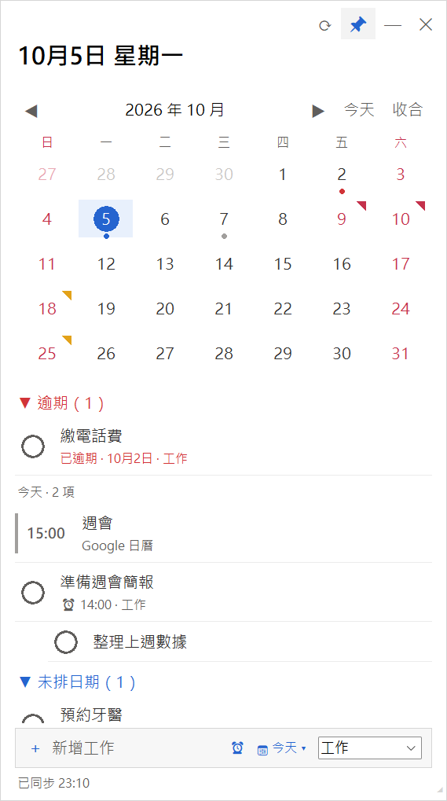</p>

## 能做什麼

- **待辦清單**：新增、完成、修改、刪除，手機 Google Tasks 會同步看到
- **月曆**：一眼看出哪天有待辦、哪天過期沒做，假日和節日會標紅
- **日曆行程**：顯示 Google 日曆的行程（只能看，不能改）
- **提醒**：幫待辦設時間，時間到電腦右下角會跳出提醒
- **子工作**：待辦底下可以再分小項目
- **不佔位置**：不會出現在工作列，按 **Ctrl + Alt + D** 隨時叫出來或藏起來

**你需要：** Windows 10 或 11 電腦、一個 Gmail 帳號、大約 15 分鐘。全部免費，不用綁信用卡。

設定只要做一次，分三步：

1. [下載 DayNote](#第一步下載-daynote)
2. [跟 Google 申請金鑰](#第二步跟-google-申請金鑰)（最久，約 10 分鐘）
3. [選金鑰並登入](#第三步選金鑰並登入)

圖片裡的紅框 **①②③** 就是要點的地方，照順序點就對了。

---

## 第一步：下載 DayNote

1. 打開 [下載頁面](https://github.com/MinHao1103/DayNote/releases/latest)，點 ①「DayNote.zip」，檔案會存到「下載」資料夾

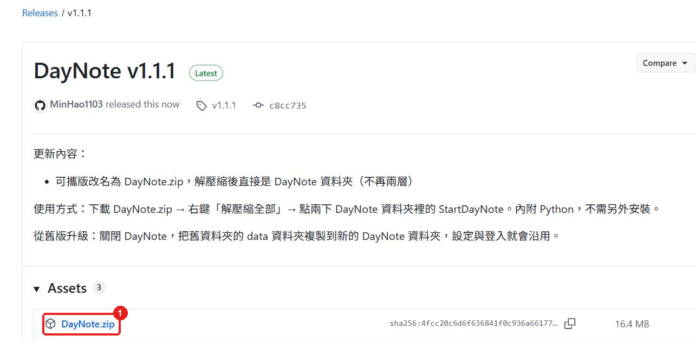

2. 打開「下載」資料夾，對 `DayNote` 按**滑鼠右鍵** → ①「解壓縮全部…」

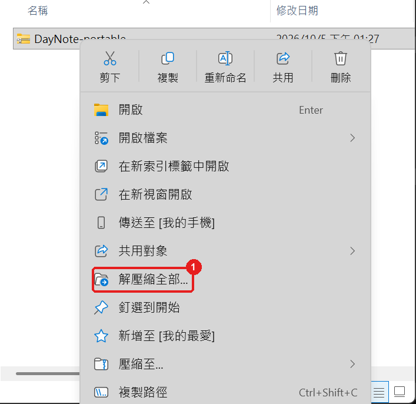

3. 按 ①「解壓縮」

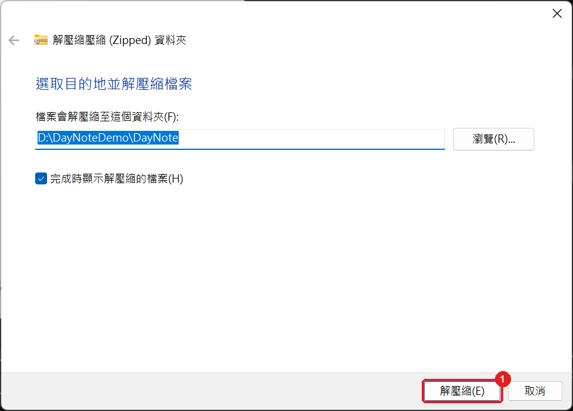

4. 會自動打開 `DayNote` 資料夾 → 對 ①「StartDayNote」**點兩下**

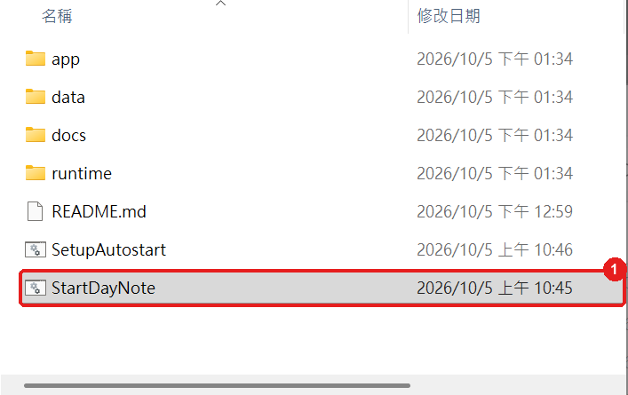

> 跳出藍色的「Windows 已保護您的電腦」：按「其他資訊」→「仍要執行」。點兩下沒反應：改用[指令啟動](#打不開-daynote)。

5. 會跳出「首次設定」視窗。**先不要關**，接著做第二步。

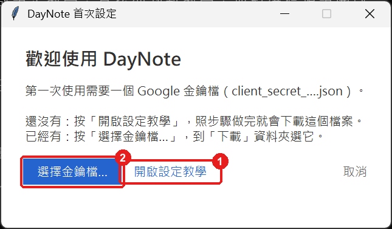

---

## 第二步：跟 Google 申請金鑰

DayNote 要讀你的待辦清單，需要 Google 給一個「金鑰檔」。照下面做，最後會下載到一個檔案。

### 2-1 建立專案

1. 打開 <https://console.cloud.google.com/>，用你的 Gmail 登入（第一次會要你同意條款：打勾 → 同意並繼續）
2. 打開 <https://console.cloud.google.com/projectcreate>
3. ① 專案名稱輸入 `DayNote` → ② 按「建立」

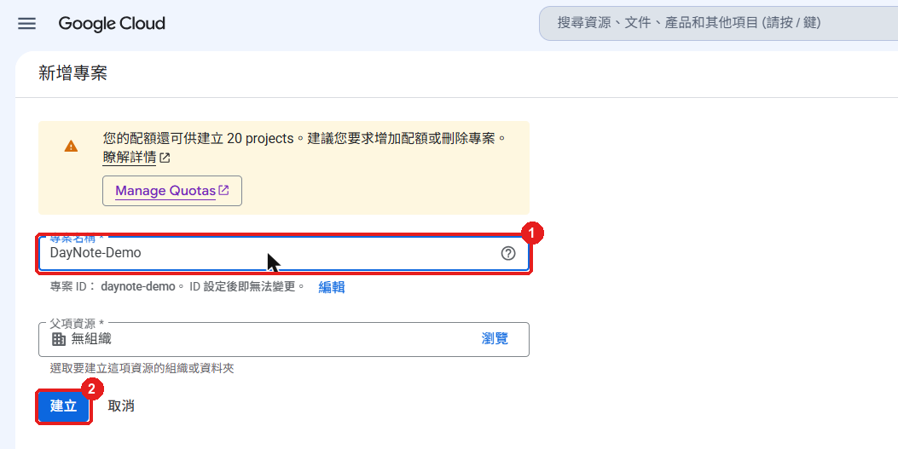

4. 右上角跳出通知，按 ①「選取專案」

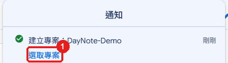

5. 確認左上角 ① 顯示 `DayNote`


### 2-2 開啟「待辦清單」功能

1. ① 在最上面的搜尋框輸入 `Google Tasks API` → 點 ② 第一個結果（注意**不是** Cloud Tasks）

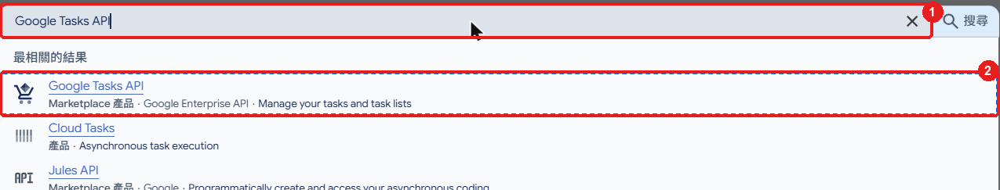

2. 按 ①「啟用」

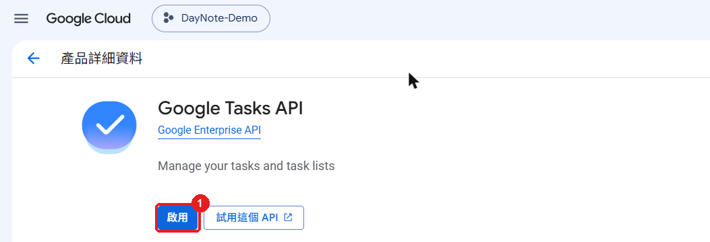

3. 看到 ①「已啟用」就好了

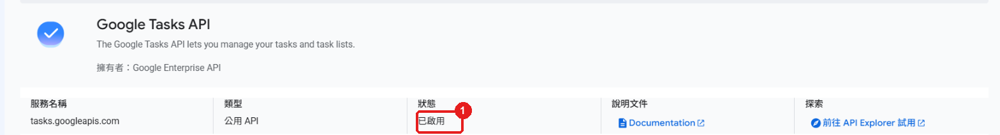

### 2-3 開啟「日曆」功能

在最上面的搜尋框輸入 `Google Calendar API` → 點第一個結果 → 按 ①「啟用」

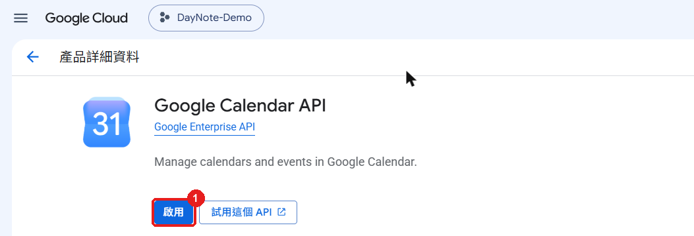

### 2-4 填寫基本資料

1. 打開 <https://console.cloud.google.com/auth/overview> → 按 ①「開始」

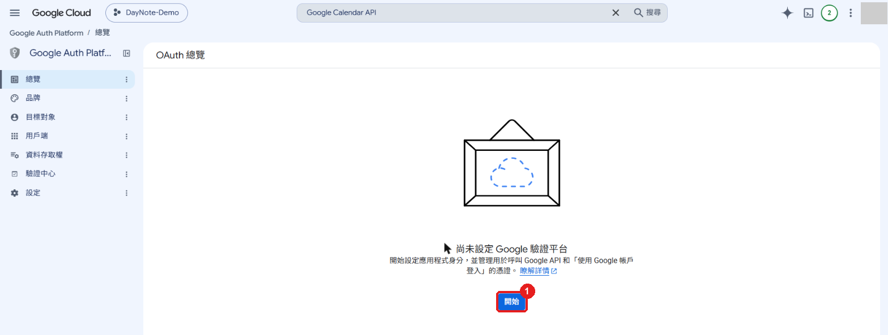

2. ① 名稱輸入 `DayNote` → ② 電子郵件選你的 Gmail → ③「下一步」

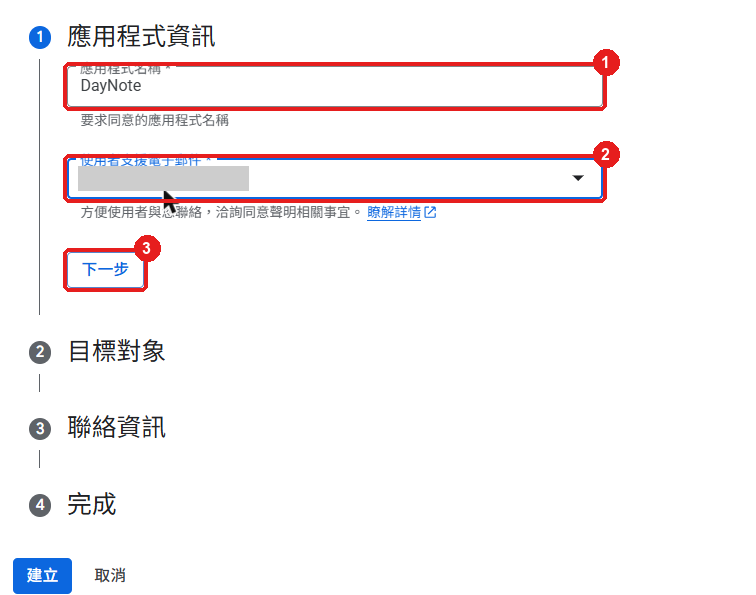

3. ① 選「外部」→ ②「下一步」

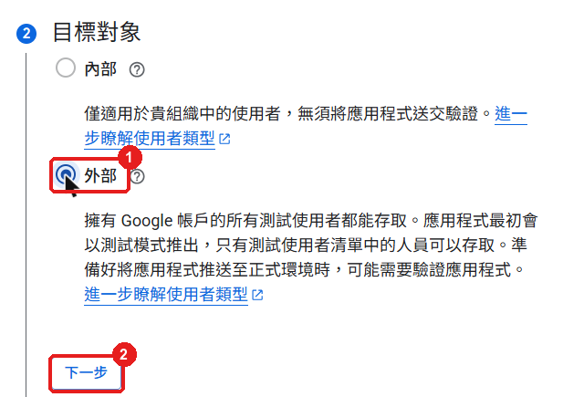

4. ① 輸入你的 Gmail → ②「下一步」

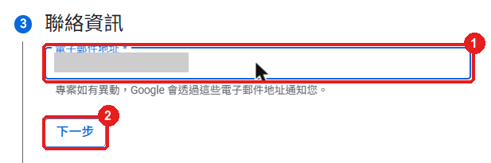

5. ① 勾選「我同意」→ ②「繼續」

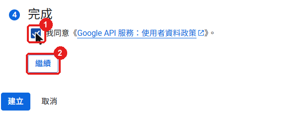

6. 按 ①「建立」

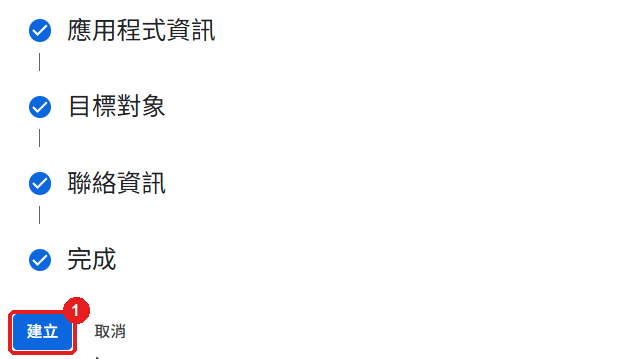

### 2-5 把自己加進使用名單

1. 點左邊的 ①「目標對象」

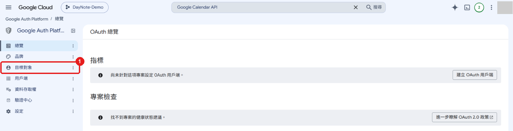

2. 往下捲，按 ①「Add users」→ ② 輸入你的 Gmail，按 Enter → ③「儲存」

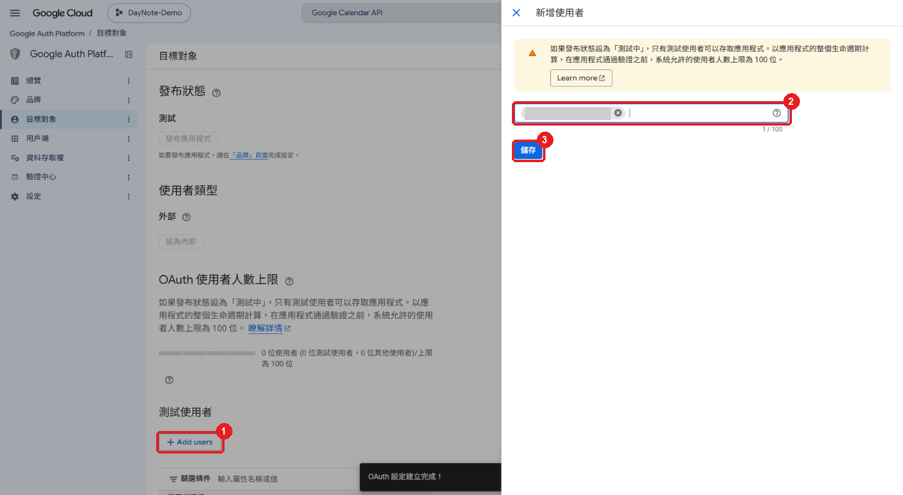

3. 確認 ① 名單裡有你的 Gmail

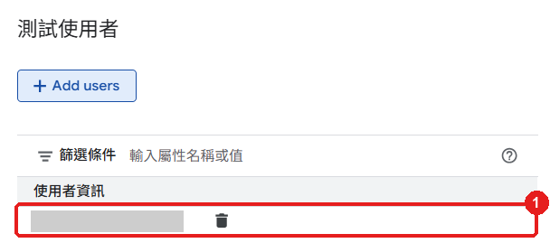

### 2-6 下載金鑰檔

1. 點左邊的 ①「用戶端」→ ②「建立用戶端」

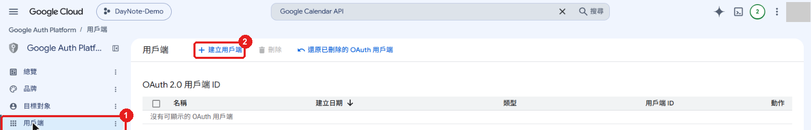

2. 應用程式類型選 ①「**電腦版應用程式**」（最後一個）

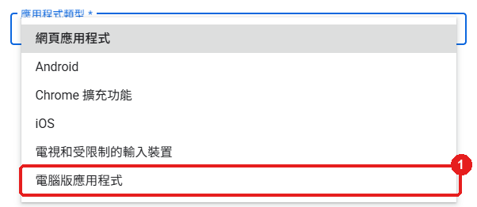

3. ② 名稱輸入 `DayNote` → ③ **不要勾** → ④「建立」

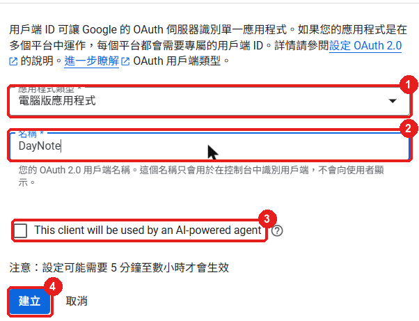

4. 按 ①「**下載 JSON**」→ 再按「確定」。檔案會存到「下載」資料夾，檔名是 `client_secret_` 開頭

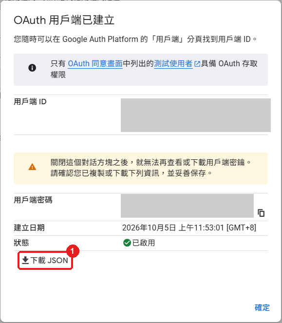

> ⚠️ 一定要先按「下載 JSON」再關視窗，關掉就不能再下載了。不小心關掉：在「用戶端」頁面把 DayNote 刪掉，重做 2-6。

---

## 第三步：選金鑰並登入

1. 回到 DayNote 的「首次設定」視窗 → 按 ②「選擇金鑰檔…」→ 到「下載」資料夾選 `client_secret_` 開頭的檔案 → 按「開啟」


2. 按 DayNote 右上角的 ①「登入」，瀏覽器會打開 → 選你的 Gmail

<p>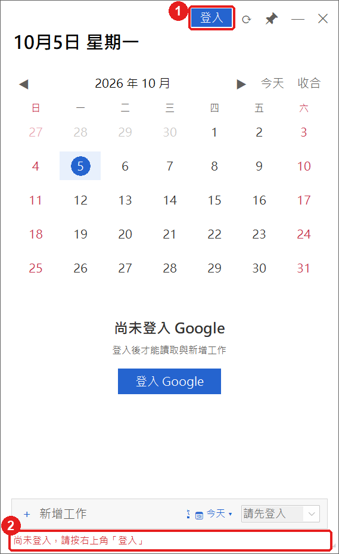</p>

3. 出現「Google 尚未驗證這個應用程式」→ 按 ①「繼續」（這是你自己建立的，可以放心）


4. ① 勾選「全選」→ ③「繼續」

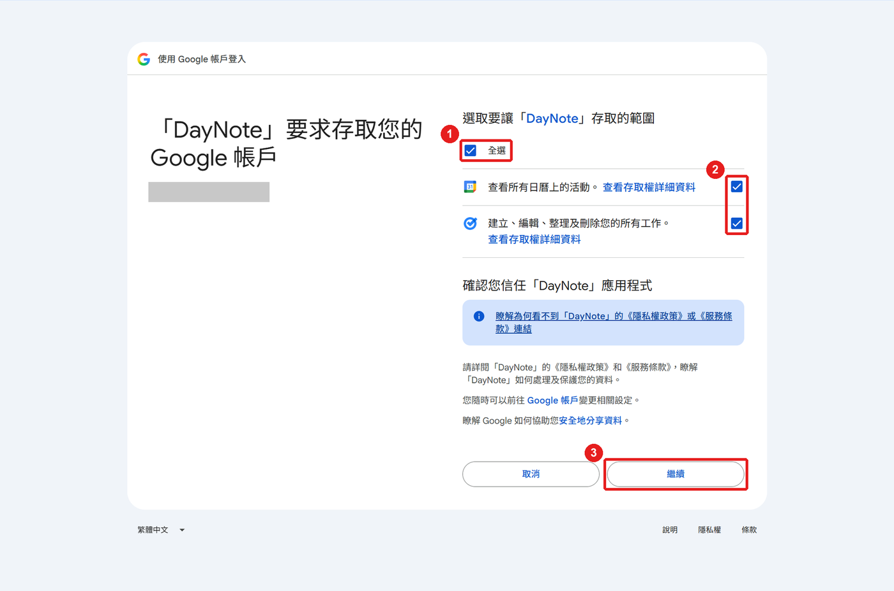

5. 看到 ① 這行字就可以關掉瀏覽器分頁。**設定完成！** DayNote 會顯示你的待辦清單。

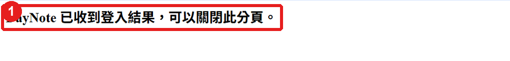

設定完成後，「下載」資料夾裡的 `client_secret_` 檔案可以刪掉。

### 建議再做一件事：避免每 7 天要重新登入

Google 預設 7 天後會要你重新登入。想要一直保持登入：

打開 <https://console.cloud.google.com/auth/audience> → 按「發布應用程式」→「確認」。只有你自己用，不需要 Google 審核。

---

## 怎麼用

**打開 DayNote**：到 `DayNote` 資料夾，點兩下 `StartDayNote`。

| 想做什麼 | 怎麼做 |
|---|---|
| 新增待辦 | 在最下面的「新增工作」輸入文字，按 Enter |
| 指定日期 | 新增前先點月曆上的日期，或按輸入框旁的「📅」選日期 |
| 設定提醒 | 新增前按「⏰」選時間，時間到右下角會跳出提醒 |
| 完成待辦 | 點待辦前面的圓圈。點錯了，5 秒內按「復原」 |
| 修改／刪除 | 點待辦的文字進去修改，改完按「← 返回」會自動儲存；上方有「刪除」 |
| 暫時藏起來 | 按右上角「—」，按 **Ctrl + Alt + D** 叫回來 |
| 永遠在最上層 | 按右上角 📌 |
| 立即同步 | 按右上角 ⟳（平常會自動同步） |
| 登出、換帳號 | 按右上角「登出」→「是」，再按「登入」 |

**月曆上的記號**：🔵 有待辦　🔴 有過期沒做完的　⚪ 只有日曆行程　紅色日期＝假日

### 開機自動打開

到 `DayNote` 資料夾，點兩下 `SetupAutostart` → 在跳出的視窗按鍵盤的 `1`，看到「已開啟開機自動啟動」後按任意鍵關閉。之後每次開機 DayNote 會自己打開。

不想要了：同樣點兩下 `SetupAutostart` → 按鍵盤的 `2`。

### 換電腦

在新電腦重做「第一步」，然後把舊電腦 `DayNote\data` 資料夾裡的 `config.json` 複製到新電腦的 `DayNote\data` 裡，打開 DayNote 按「登入」就好，不用重新申請金鑰。

---

## 遇到問題怎麼辦

| 狀況 | 怎麼辦 |
|---|---|
| 點兩下 `StartDayNote` 沒反應 | 看[下面的「打不開 DayNote」](#打不開-daynote) |
| DayNote 不見了 | 按 **Ctrl + Alt + D**；還是沒有，就重新點兩下 `StartDayNote` |
| 登入時出現「403 access_denied」 | 2-5 沒把自己加進名單，回去加；剛加完要等幾分鐘 |
| 登入時出現「invalid_client」 | 金鑰剛建立還沒生效，等 5 分鐘再試 |
| 顯示「登入已過期或權限已撤銷」 | 按右上角「登入」重新登入；不想每 7 天登一次，做[這一步](#建議再做一件事避免每-7-天要重新登入) |
| 顯示「HTTP 403」 | 登入時沒有「全選」。按「登出」，再「登入」一次，記得勾「全選」 |
| 顯示「設定檔有誤」，或想換一組金鑰 | 刪掉 `DayNote\data\config.json`，重新打開 DayNote，從第三步重選金鑰 |
| 顯示「網路連線失敗」 | 檢查網路，按右上角 ⟳ 重試 |
| 顯示「TLS 憑證驗證失敗」 | 公司網路擋住了，請公司 IT 協助 |
| 提醒沒有跳出來 | 提醒只在 DayNote 開著時才會跳。建議設定[開機自動打開](#開機自動打開) |
| 手機上看到待辦多了一行 `⏰ 15:00` | 正常，這是 DayNote 記錄提醒時間的方式，不要刪掉 |

### 打不開 DayNote

公司電腦有時會擋住 `StartDayNote`，可以改用下面的方法：

1. 打開 `DayNote` 資料夾
2. 點檔案總管最上面的**網址列**（顯示資料夾路徑的地方），輸入 `cmd`，按 Enter
3. 跳出黑色視窗後，貼上下面這行，按 Enter：

```bat
start "" runtime\pythonw.exe app\daynote.pyw
```

DayNote 打開後，黑色視窗可以關掉。

還是打不開，在同一個黑色視窗貼上下面這行，把視窗裡出現的文字截圖給維護的人：

```bat
runtime\python.exe app\daynote.pyw
```

---

## 要知道的事

- 手機 Google Tasks 不會跳 DayNote 設的提醒，只有電腦上的 DayNote 會
- 刪除的待辦沒辦法復原
- 星號、粗體、圖片這些格式，DayNote 不支援
