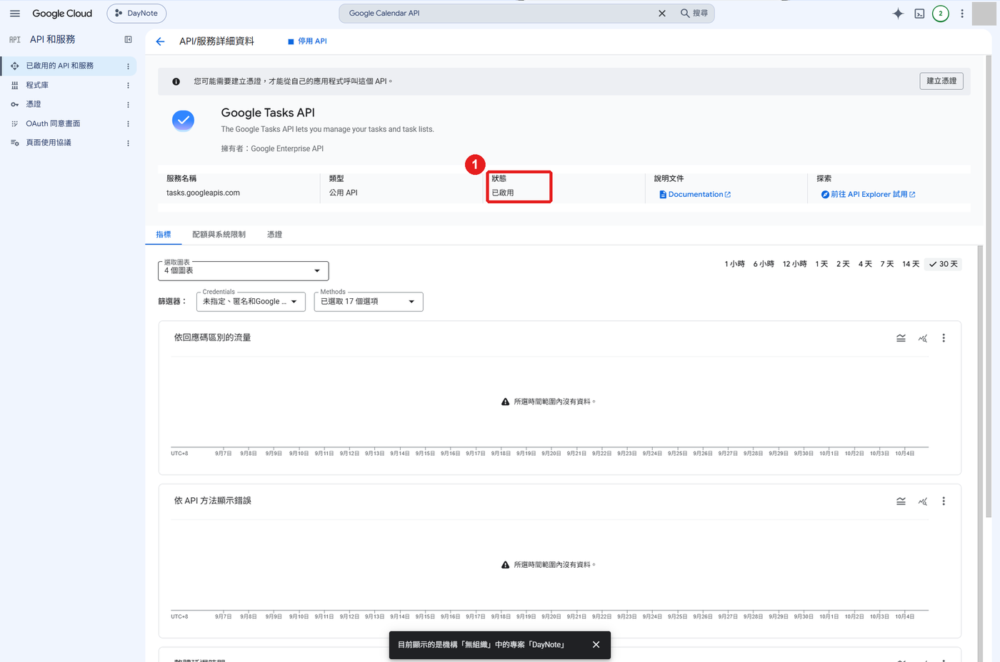
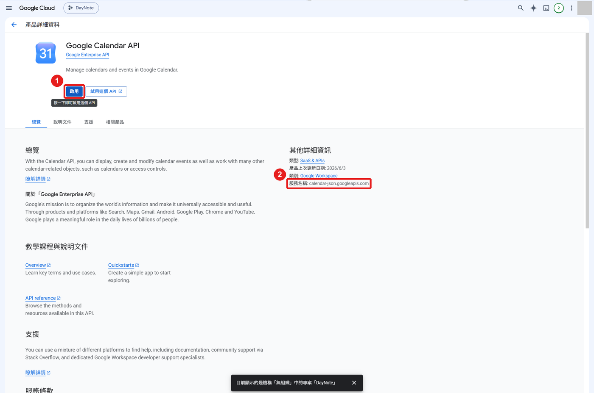

# DayNote 第一次設定

約 10 分鐘，只需做一次。準備：一個 Gmail 帳號。

圖中紅框 **①②③** 就是要點的地方。

---

## 第一部分：取得 Google 金鑰檔

### 1. 開啟 Google Cloud

1. 打開瀏覽器，到 <https://console.cloud.google.com/>
2. 用你的 Gmail 登入
3. 第一次進去會出現條款：勾選同意 → 按「同意並繼續」

### 2. 建立專案

1. 點 ① 左上角的專案選單
2. 按「新增專案」
3. 專案名稱輸入 `DayNote` → 按「建立」
4. 再點一次 ①，選 `DayNote`
5. 確認 ② 顯示 DayNote

### 3. 開啟 Google Tasks API

1. 點最上方的搜尋框，輸入 `Google Tasks API`，點搜尋結果
2. 按 ①「啟用」

3. 看到 ①「已啟用」就完成

### 4. 開啟 Google Calendar API

1. 點最上方的搜尋框，輸入 `Google Calendar API`，點搜尋結果
2. 按 ①「啟用」

### 5. 設定同意畫面

1. 點左上角 ☰ →「API 和服務」→「OAuth 同意畫面」
2. 按 ①「開始」

3. 照下表填，每頁填完按「下一步」：

| 頁面 | 要做的事 |
|---|---|
| 應用程式資訊 | 名稱輸入 `DayNote`，電子郵件選你的 Gmail |
| 目標對象 | 選「**外部**」 |
| 聯絡資訊 | 輸入你的 Gmail |
| 完成 | 勾選「我同意」→ 按「繼續」→ 按「建立」 |

### 6. 加入自己為測試使用者

1. 點左側 ①「目標對象」

2. 往下找到「測試使用者」，按 ①「Add users」
3. 輸入你的 Gmail → 按 ③「儲存」
4. 確認 ② 清單出現你的 Gmail

### 7. 建立並下載金鑰檔

1. 點左側「用戶端」→「建立用戶端」
2. ① 應用程式類型選「**電腦版應用程式**」
3. ② 名稱輸入 `DayNote`
4. ③ 這格**不要勾**
5. 按 ④「建立」

6. 跳出的視窗中按「**下載 JSON**」

檔案會存到「下載」資料夾，檔名是 `client_secret_` 開頭。

> ⚠️ 這個視窗關掉後就不能再下載。沒下載到：在「用戶端」列表刪除 DayNote，重做第 7 步。

---

## 第二部分：設定 DayNote

### 8. 選擇金鑰檔

1. 點兩下 DayNote 資料夾裡的 `StartDayNote.bat`
2. 出現「DayNote 首次設定」視窗，按 ②「選擇金鑰檔…」
3. 選「下載」資料夾裡 `client_secret_` 開頭的檔案 → 按「開啟」

### 9. 登入 Google

1. 按右上角 ①「登入」，瀏覽器會打開

2. 選你的 Gmail
3. 出現「未經 Google 驗證」→ 按 ①「繼續」

4. 按 ①「全選」→ 按 ③「繼續」

5. 看到 ① 這行字，關掉這個分頁

**完成！** 回到 DayNote 就能使用。

---

## 遇到問題

| 看到 | 怎麼做 |
|---|---|
| 「已封鎖存取權」「403 access_denied」 | 重做第 6 步，Gmail 要一字不差；做完等 5 分鐘再登入 |
| 選金鑰檔後顯示「網頁應用程式」 | 第 7 步選錯類型，重做並選「電腦版應用程式」 |
| 瀏覽器顯示 `invalid_client` | 金鑰剛建立，等 5 分鐘再試 |
| 按登入沒反應 | 打開瀏覽器，按 `Ctrl + V` 貼上網址 |
| 約 7 天後要重新登入 | 正常，按「登入」即可。不想重登：到「目標對象」按「發布應用程式」 |

